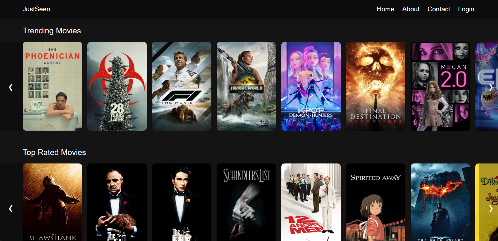
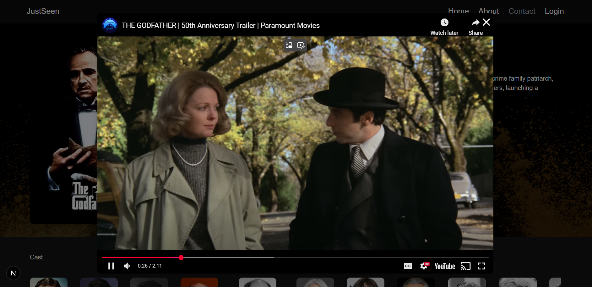
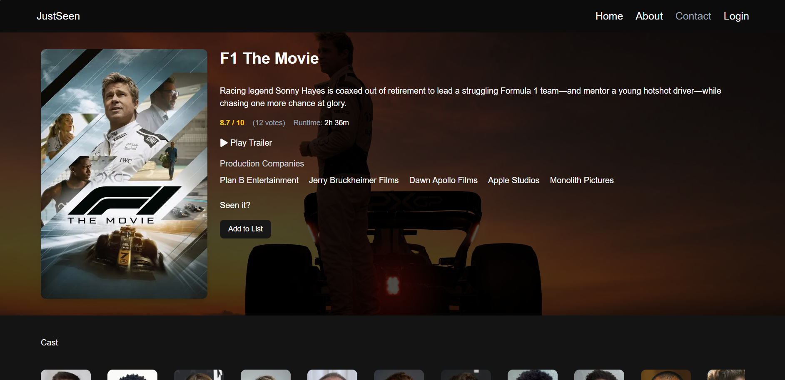
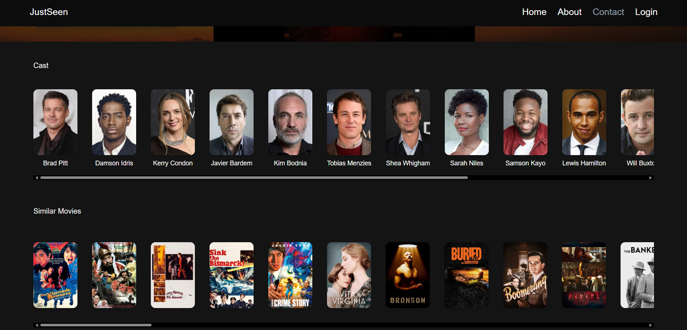

# Just Seen

Just Seen is a movie discovery platform built with Next.js, React, Tailwind CSS, GSAP, and TypeScript. It offers a minimalist interface for exploring popular and trending movies with smooth animations, detailed previews, and responsive design.

## Live Demo

[https://justseen.vercel.app](https://justseen.vercel.app)

## Features

- Browse trending and popular movies
- Preview trailers in animated modals
- View movie details including cast and overview
- Fully responsive layout
- Smooth GSAP-based transitions

## Screenshots

**Home Page (Desktop)**  


**Trailer Modal Preview**  


**Movie Details Page**  


**Cast and Similar Movies**  


## Tech Stack

- **Next.js** – React framework with SSR
- **React.js** – Component-based architecture
- **Tailwind CSS** – Utility-first styling
- **SASS** – Additional styling options
- **GSAP** – Advanced animation support
- **TypeScript** – Static type checking

## Getting Started

1. **Clone the repository**
   ```bash      
   git clone https://github.com/your-username/just-seen.git
   cd just-seen
   ```
2. **Install dependencies**
   ```bash
   npm install
   ```
3. **Set up environment variables**
   ```bash
   NEXT_PUBLIC_TMDB_API_KEY=your_tmdb_api_key
   ```
4. **Run the development server**
   ```bash
   pnpm run dev
   ```
## API
  Movie data is fetched from The Movie Database (TMDb) API. You need a free API key from TMDb to run this project.
